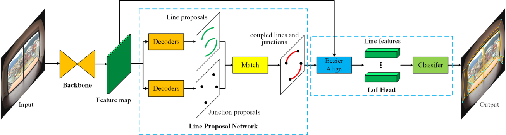

[](https://github.com/lh9171338/Outline) ULSD-ISPRS
===
This repository contains the official PyTorch implementation of the paper: [ULSD: Unified Line Segment Detection across Pinhole, Fisheye, and Spherical Cameras](https://www.sciencedirect.com/science/article/abs/pii/S0924271621001623).

## Introduction
[ULSD](https://www.sciencedirect.com/science/article/abs/pii/S0924271621001623) is a unified line segment detection method for both distorted and undistorted images from pinhole, fisheye or spherical cameras. With a novel line segment representation based on the Bezier curve, our method can detect arbitrarily distorted line segments. Experimental results on the pinhole, fisheye, and spherical image datasets validate the superiority of the proposed ULSD to the SOTA methods both in accuracy and efficiency. Especially, the performance of ULSD trained on the three-mixed dataset further demonstrates its effectiveness and generality across the three common camera model.

## Network Architecture
<p align="center"></p>
    
## Results

### Quantitative Comparisons

<html>
<table align="center">
	<tr>
		<td rowspan="2" colspan="1" align="center">Method</td>
		<td rowspan="2" colspan="1" align="center">Training Dataset</td>
		<td rowspan="1" colspan="5" align="center"><a href="https://drive.google.com/drive/folders/1K-pGDDPrXkCmWCcoyYvURZ86ZzA5O6E_?usp=sharing">Mixed Dataset</a></td>
		<td rowspan="2" colspan="1" align="center">FPS</td>
	</tr>
	<tr>
		<td align="center">sAP<sup>5</sup></td>
		<td align="center">sAP<sup>10</sup></td>
		<td align="center">sAP<sup>15</sup></td>
		<td align="center">msAP</td>
		<td align="center">mAP<sup>J</sup></td>
	</tr>
	<tr>
		<td align="center">HT</td>
		<td align="center">-</td>
		<td align="center">0.9</td>
		<td align="center">1.7</td>
		<td align="center">2.5</td>
		<td align="center">1.7</td>
		<td align="center">6.1</td>
		<td align="center">0.3</td>
	</tr>
	<tr>
		<td align="center"><a href="https://github.com/zhou13/lcnn">L-CNN</a></td>
		<td align="center">P</td>
		<td align="center">46.7</td>
		<td align="center">49.9</td>
		<td align="center">51.4</td>
		<td align="center">49.3</td>
		<td align="center">50.6</td>
		<td align="center">13.4</td>
	</tr>
	<tr>
		<td align="center"><a href="https://github.com/cherubicXN/hawp">HAWP</a></td>
		<td align="center">P</td>
		<td align="center">50.3</td>
		<td align="center">53.3</td>
		<td align="center">54.8</td>
		<td align="center">52.8</td>
		<td align="center">50.4</td>
		<td align="center">32.0</td>
	</tr>
	<tr>
		<td align="center">ULSD (Ours)</td>
		<td align="center">P</td>
		<td align="center">50.8</td>
		<td align="center">54.6</td>
		<td align="center">56.4</td>
		<td align="center">53.9</td>
		<td align="center">60.6</td>
		<td align="center"><b>37.0</b></td>
	</tr>
	<tr>
		<td align="center">ULSD (Ours)</td>
		<td align="center">P+F+S</td>
		<td align="center"><b>63.0</b></td>
		<td align="center"><b>67.2</b></td>
		<td align="center"><b>69.1</b></td>
		<td align="center"><b>66.4</b></td>
		<td align="center"><b>61.6</b></td>
		<td align="center">36.9</td>
	</tr>
</table>
</html>

### Qualitative Comparisons

<p align="center">
    
</p> 


## Requirements

* python3
* pytorch==1.6.0
* CUDA==10.1
* opencv, numpy, scipy, matplotlib, argparse, yacs, tqdm, json, multiprocessing, sklearn, tensorboardX

## Step-by-step installation
```shell
conda create --name ulsd python=3.7
conda activate ulsd

cd <ulsd-path>
git clone https://github.com/lh9171338/ULSD-ISPRS.git
cd ULSD-ISPRS

pip install -r requirements.txt
conda install pytorch==1.6.0 torchvision==0.7.0 cudatoolkit=10.1 -c pytorch
```

## Quickstart with the pretrained model
* There are 4 pretrained models (**mixed.pkl**, **pinhole.pkl**, **fisheye.pkl**, and **spherical.pkl**) in [Google drive](https://drive.google.com/drive/folders/1YkK4nvMLJm12GclxJ8SOdzCZlKcDHjPR?usp=sharing) or [Baiduyun](https://pan.baidu.com/s/1YM0ARY-7A-O0n8s7ngDDSw?pwd=gac7)
. Please download them and put in the **model/** folder.
* Put your test images in the **dataset/** folder.
```shell
python test.py --dataset_name <DATASET_NAME> --order 4 --model_name <MODEL_NAME> --save_image
```
* The results are saved in the **output/** folder.

## Training & Testing

### Data Preparation

* Download the json-format dataset from [Google Drive](https://drive.google.com/drive/folders/1K-pGDDPrXkCmWCcoyYvURZ86ZzA5O6E_?usp=sharing).
* Unzip the dataset to the **dataset/** folder.
* Convert the dataset from json-format to npz-format.
```shell
cd dataset/
python json2npz.py --dataset_name <DATASET_NAME> --order <ORDER>
```

* Generate the ground truth for evaluation.
```shell
cd dataset/
python json2npz_gt.py --dataset_name <DATASET_NAME>
```

### Train

```shell
python train.py --dataset_name <DATASET_NAME> --order <ORDER> --model_name <MODEL_NAME> [--gpu <GPU_ID>]
```

### Test

```shell
python test.py --dataset_name <DATASET_NAME> --order <ORDER> --model_name <MODEL_NAME> --save_image [--gpu <GPU_ID>]
```

### Evaluation

```shell
python test.py --dataset_name <DATASET_NAME> --order <ORDER> --model_name <MODEL_NAME> --evaluate [--gpu <GPU_ID>]
```

## Annotation Tool

* There is a line segment annotation tool [**Labelline**](https://github.com/lh9171338/Labelline) for pinhole, fisheye, and spherical images. If you want to build your own training dataset, it's may be helpful.

## Citation
```
@article{LI2021187,
    title = {ULSD: Unified line segment detection across pinhole, fisheye, and spherical cameras},
    author = {Hao Li and Huai Yu and Jinwang Wang and Wen Yang and Lei Yu and Sebastian Scherer},
    journal = {ISPRS Journal of Photogrammetry and Remote Sensing},
    volume = {178},
    pages = {187-202},
    year = {2021},
}
```

